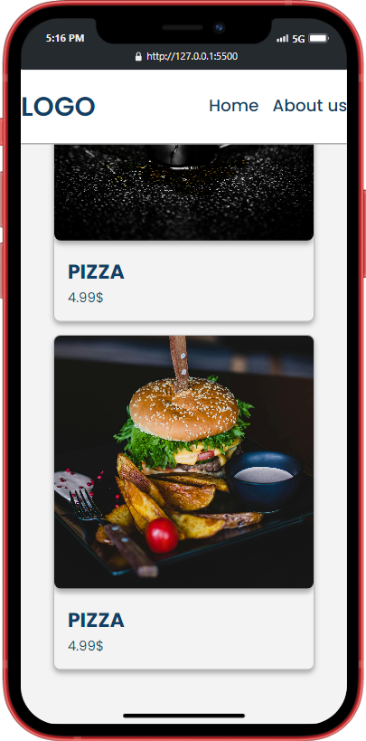

# online-menu-app

This project aims to create a simple online menu interface and integrate a menu link into a QR code generated with Python. The project uses SCSS for the frontend design of the menu interface and Python for QR code integration.

## Table of Contents

- [Features](#features)
- [Screenshots](#screenshots)
- [Installation](#installation)
- [Scanning](#scanning)
- [Usage](#usage)

## Features

- Responsive menu interface using SCSS.
- QR code generation with Python and integration of the menu link into the code.
- Fast access to the menu through QR code scanning, linked to the menu interface.

## Screenshots

### Desktop Preview


### Mobile Preview



## Scanning QR Code

- You can access the online menu by scanning the QR code below.


## Installation

1. Clone the repository:

   ```bash
   git clone https://github.com/SimplyProgYT/online-menu-qr-code.git
   ```

2. Install the required packages:
   ```bash
   pip install -r requirements.txt
   ```
